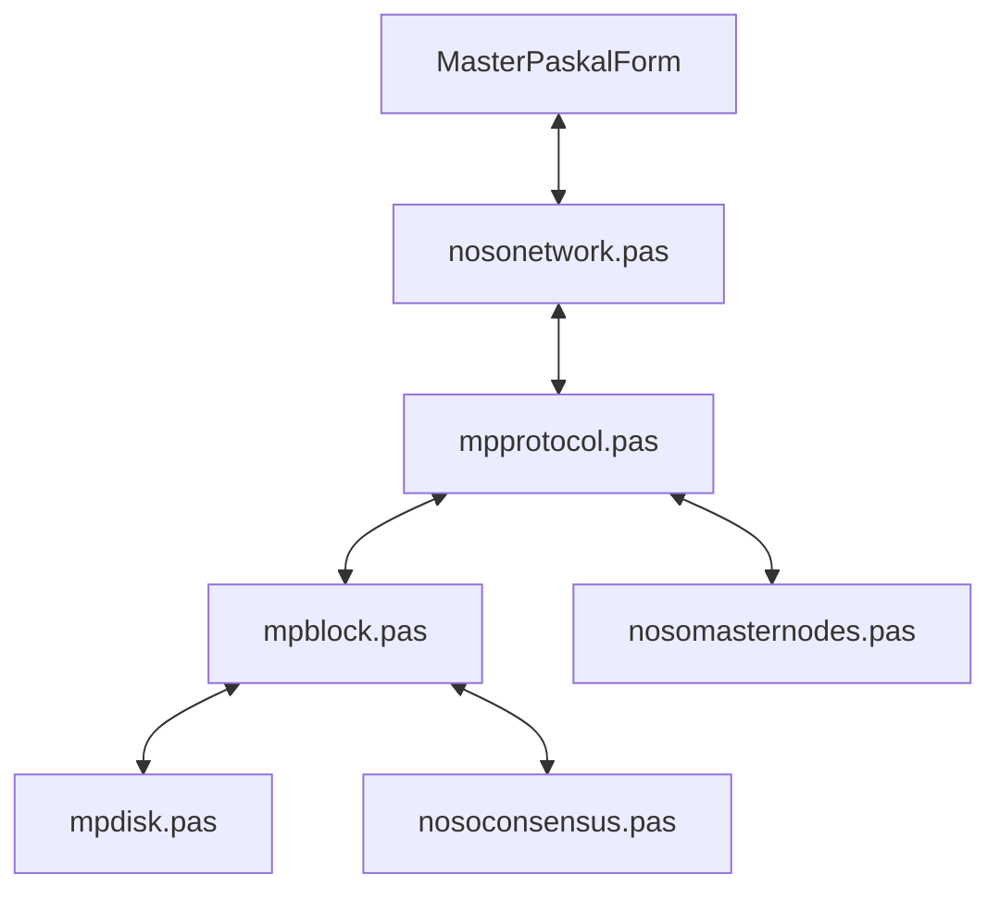

# NosoNode Architecture

This document describes the high-level architecture of the NosoNode project, a Pascal-based implementation of the Nosocoin node.

## Overview

NosoNode is built using the **Lazarus IDE** and **Free Pascal**. It follows a monolithic architecture where the UI (VCL/LCL) and the core logic are tightly coupled, primarily centered around the `MasterPaskalForm`.

## Core Components

### 1. Networking Layer (`nosonetwork.pas`)
- **Technology**: Uses Indy 10 (`TIdTCPServer`, `TIdTCPClient`).
- **Slot Management**: Manages peer connections using a fixed-size array (`Conexiones`) of up to 99 slots.
- **Threading**: Each connection is handled in its own thread, but synchronization often relies on global critical sections (`CSPending`, `CSNodesList`).

### 2. Protocol Parser (`mpprotocol.pas`)
- **Command Handling**: Implements a custom text-based protocol using `SPACE` and `$` delimiters.
- **Entry Point**: `ParseProtocolLines` scans all incoming data from slots and dispatches to specific handlers (e.g., `ProcessPing`, `SendPendingsToPeer`).

### 3. Block & Consensus (`mpblock.pas`, `nosoconsensus.pas`)
- **Block Structure**: Blocks are serialized to files in the `BLKS` directory.
- **Validation**: Implements Proof-of-Work (PoW) and Masternode validation logic.
- **Building Blocks**: `BuildNewBlock` handles the transition from pending transactions in the pool to a new block.

### 4. Data Management (`mpdisk.pas`, `mpcoin.pas`)
- **Persistence**: Custom file formats for blocks, masternodes, and GVTs.
- **Serialization**: Heavy use of `Parameter(line, index)` for parsing space-separated strings.

## Module Interaction

## Data Flow (Incoming Message)
1. `NodeServerEvents` (in `nosonetwork`) receives raw text.
2. Text is stored in `SlotLines` array.
3. `ParseProtocolLines` (in `mpprotocol`) is called periodically from a timer or main loop.
4. `Parameter` function extracts the command and arguments.
5. Corresponding logic is executed (e.g., adding to `ArrayPoolTXs`).
