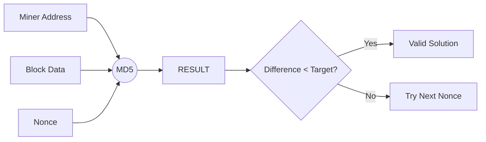

# Noso Cryptographic Schematics

This document explains the cryptographic algorithms and workflows used in NosoNode.

## 1. Address Generation Flow
Noso uses a custom address format starting with `N` (Regular) or `M` (Multi-sig). It relies on **SECP256K1** and **SHA2-256/MD-160**.

```mermaid
graph TD
    PK[Private Key] -->|SECP256K1| PUB[Public Key]
    PUB -->|SHA2-256| H1[SHA256 Hash]
    H1 -->|RIPEMD-160| H2[RIPEMD160 Hash]
    H2 -->|Base58| B58[Base58 String]
    B58 -->|Checksum| CS[Address Checksum]
    B58 + CS -->|Prefix 'N'| ADDR[Noso Address]
```

### Key Functions (`nosocrypto.pas`):
- `GenerateNewAddress`: Generates a key pair and returns the address.
- `GetAddressFromPublicKey`: Implementation of the flow above.
- `BMB58resumen`: Custom checksum calculation based on Base58 string.

## 2. Transaction Signing
Transactions are signed using the private key associated with the sender's address.

1. **Message Construction**: `OWN + Address + Timestamp`.
2. **Hashing**: SHA2-256 hash of the message.
3. **Signing**: SECP256K1 signature of the hash.
4. **Encoding**: Base64 encoding of the signature.

### Key Functions:
- `GetStringSigned`: Signs a message string.
- `VerifySignedString`: Validates a signature against a public key.

## 3. Proof of Work (PoW)
Noso uses a custom "Target Hash" difficulty system.

- **Algorithm**: MD5 (Note: Considered weak for modern PoW, but legacy for this project).
- **Target**: `Diference` between two hashes.
- **Verification**: `CheckHashDiff` compares the miner's solution hash against the block's target hash.



## 4. Base Conversions
The project extensively uses custom base conversion functions in `nosocrypto.pas`:
- `B16toB58`: Hexadecimal to Base58.
- `B16ToB36`: Hexadecimal to Base36.
- `BMHexToDec`: Hexadecimal to Decimal.

> [!IMPORTANT]
> These custom implementations are critical for consistency but should be replaced with standardized libraries in the new project to avoid "questionable" edge cases.
