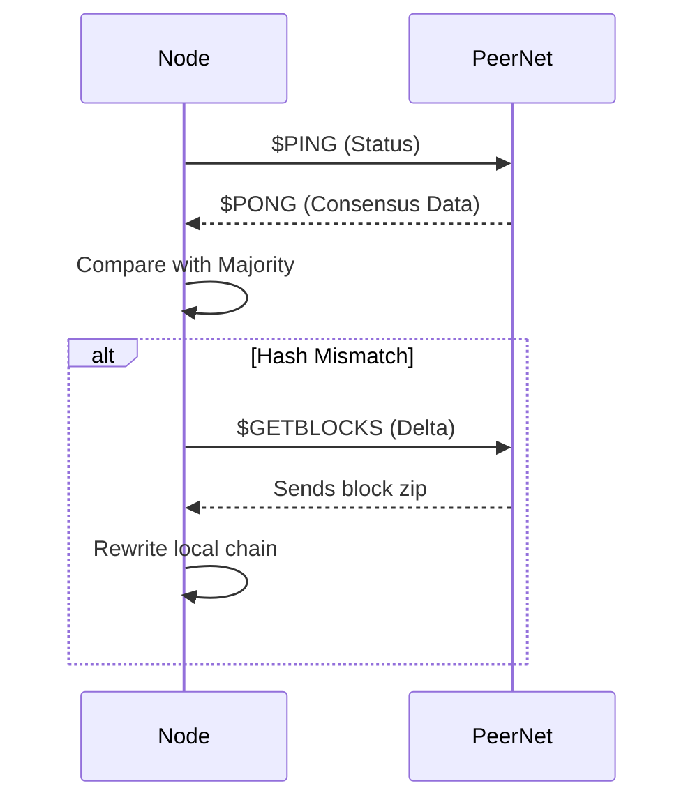

# NosoNode Logic Flows

Explanations of the most complex procedures in the node.

## 1. Consensus Mechanism
The consensus is "distributed polling". Nodes don't just trust one peer; they calculate a majority view.

1. **Trigger**: Every round (defined in `nosotime`), the node starts `CalculateConsensus`.
2. **Consulting**: It spans multiple threads (`TThreadNodeStatus`) to query several seed/peer nodes.
3. **Data Gathered**: Block height, Last Block Hash, Masternode Count, GVTs Hash, etc.
4. **Majority Voting**: `CalculateConsensus` counts occurrences of each response and picks the most frequent.
5. **Enforcement**: If the local node differs, it triggers a recovery or sync (e.g., downloading missing blocks).

## 2. Block Production (`BuildNewBlock`)
When the timer reaches the block end:

1. **Reward Calculation**: Subsidy + accrued fees.
2. **Transaction Selection**: 
    - Pulls from `ArrayPoolTXs` (mempool).
    - Re-validates balances using `SummaryValidPay`.
    - Handles special payments (Dev funds, PoS rewards, Masternode shares).
3. **Masternode Credit**: Processes `ArrMNChecks` to reward verified masternodes.
4. **Finalization**: Writes the `.blk` file and updates the local balance index (`Summary.nos`).

## 3. P2P Syncing
Nodes keep each other updated via `$PING/$PONG`.

- **Height Mismatch**: If a peer has a higher block, the node requests the delta via `$GETBLOCKS`.
- **Mempool Sync**: `$GETPENDING` pulls unknown transactions from peers.
- **Masternodes Sync**: `MNFILE` messages distribute the current list of active servers.

## 4. Fork Handling
> [!WARNING]
> Fork handling in the current implementation is basic. If a node detects it's on a "bad" chain (consensus hash mismatch), it often requires manual intervention or a full resync from a known good height.

