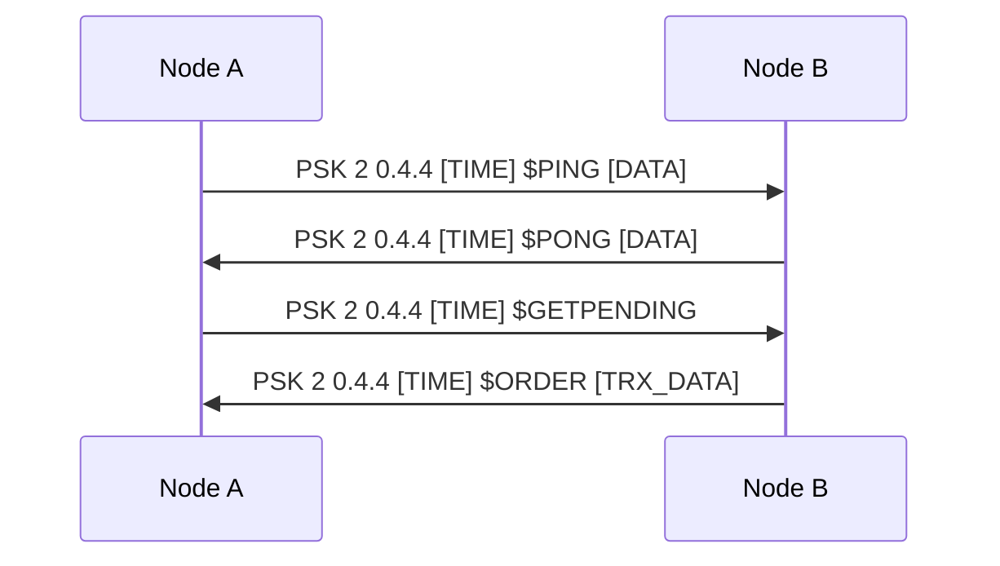

# NosoNode Protocol Specification

The NosoNode project uses a custom, text-based P2P protocol for communication between nodes.

## Message Format

All protocol messages are strings separated by spaces (` `). The general header format is:

`TYPE PROTOCOL_VER CLIENT_VER TIMESTAMP COMMAND_OR_FLAG [ARGS...]`

- **TYPE**: Usually `PSK` or `NOS`.
- **PROTOCOL_VER**: Integer (e.g., `2`).
- **CLIENT_VER**: Version string (e.g., `0.4.4`).
- **TIMESTAMP**: Unix timestamp.

## Key Commands

### PING / PONG
Used for heartbeat and peer synchronization.
- **Format**: `PSK 2 0.4.4 [TIME] $PING [PING_DATA]`
- **Ping Data**: Includes block height, headers hash, and pending transaction count.

### $GETPENDING
Request the list of pending transactions in the mempool.
- **Response**: Sends the transaction details line by line.

### ORDER
Used to broadcast a new transaction.
- **Format**: `PSK 2 0.4.4 [TIME] ORDER [ORDER_DATA]`

### $GETGVTS / $GETPSOS
Request for specific consensus data (GVTs or PoS state).

## Data Parsing
The project relies on a custom `Parameter(string, index)` function which splits the input by spaces. 
> [!WARNING]
> This approach is brittle if data fields contain spaces that are not properly escaped or if the number of parameters changes across versions.

## Sequence Diagram (Handshake)

